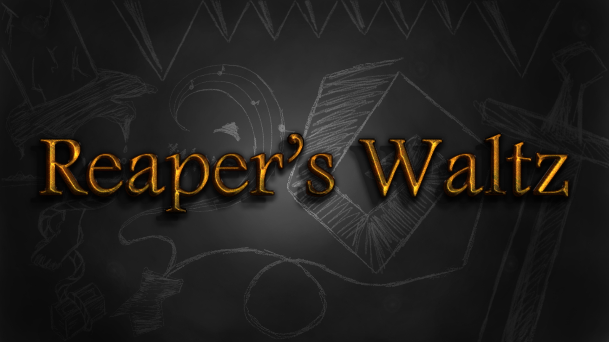

# Reapers Waltz

## Description

Topdown 2D roguelite dungeon crawler game made for the Isekai Horror Jam 2025. While the game was no officially submitted, a lot of hard work was put into it before and after the jam.

### Features

 - $(Project Feature 01)
 - $(Project Feature 02)
 - $(Project Feature 03)

## Controls

Keyboard/Mouse:
 - arrow keys to move
 - 'x' key for action

## Screenshots

_TODO: Show your game to the world, animated GIFs recommended!._

## Credits

 - [Ashassault](https://ashassault.itch.io/) - 2D Art / Game Design
 - [fenixfables](https://itch.io/profile/fenixfables) - 2D Art / Animation / Game Design
 - [Paradoxid](https://itch.io/profile/paradoxid) - 2D Art / SFX / Music / Game Design
 - [mylo-vanna](https://mylo-vanna.itch.io/) - SFX / Music / Game Design
 - [wake1st](https://wake1st.itch.io/) - Programmer

## Links

 - YouTube Gameplay: $(YouTube Link)
 - itch.io Release: [isekai-horror-game-jam](https://ashassault.itch.io/isekai-horror-game-jam)
 - Steam Release: $(Steam Game Page)

## License

This project sources are licensed under an unmodified zlib/libpng license, which is an OSI-certified, BSD-like license that allows static linking with closed source software. Check [LICENSE](LICENSE) for further details.

*Copyright (c) 2025 Joel Wakefield (Wake1st)*
